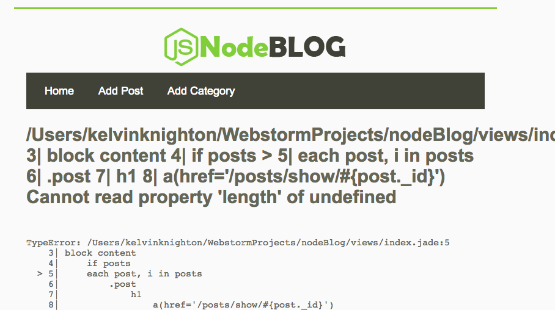

# nodeBlog
A basic blog build with node/mongodb/express/jade
=========

Was working but i guess an module via npm is old
so it throws an error and loads this
pretty site to hold

Yea, i totally have to fix it, when i need to salvage from
it and make a newer, better version.

> made following teacher on udemy.
